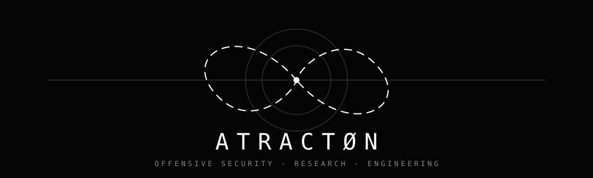

[README.md](https://github.com/user-attachments/files/32961231/README.md)

 

**Security Research · Offensive Security · Adversarial Engineering**

Studying attack surfaces, trust boundaries, system behavior and controlled exploitation.

---

### Research surface

`WEB SECURITY` &nbsp; `LINUX` &nbsp; `NETWORKS` &nbsp; `VULNERABILITY RESEARCH` &nbsp; `REVERSE ENGINEERING` &nbsp; `AUTOMATION`

I build controlled labs, document technical findings, and develop small tools that make security research reproducible. Public work here is intended for systems I own, purpose-built labs, CTFs, or environments where testing is authorized.

### Selected work

| Project | Focus | State |
|---|---|---|
| **Research** | Vulnerability analysis and technical experiments | Building |
| **Labs** | Reproducible security environments | Building |
| **Tools** | Automation and research utilities | Building |
| **Write-ups** | Authorized labs, CTFs and technical notes | Building |

### Toolchain

`Python` · `Bash` · `Linux` · `Git` · `Docker` · `Burp Suite` · `Nmap` · `Wireshark` · `GDB`

---

<code>ATRACTØN // observe · test · understand · document</code>

